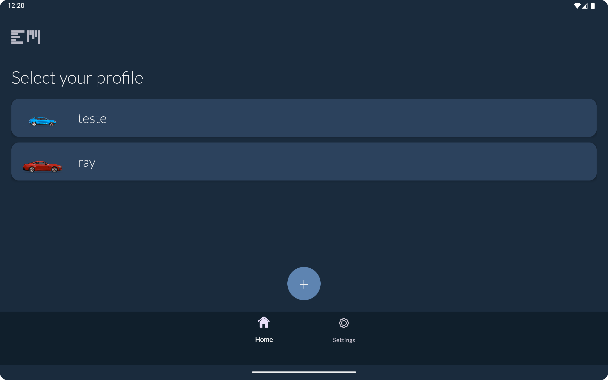
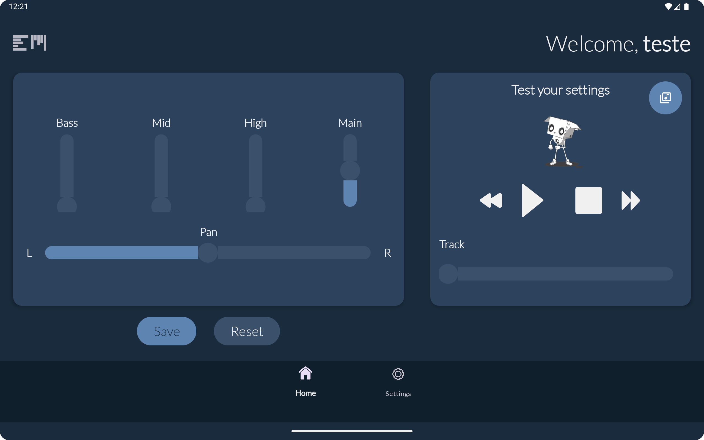
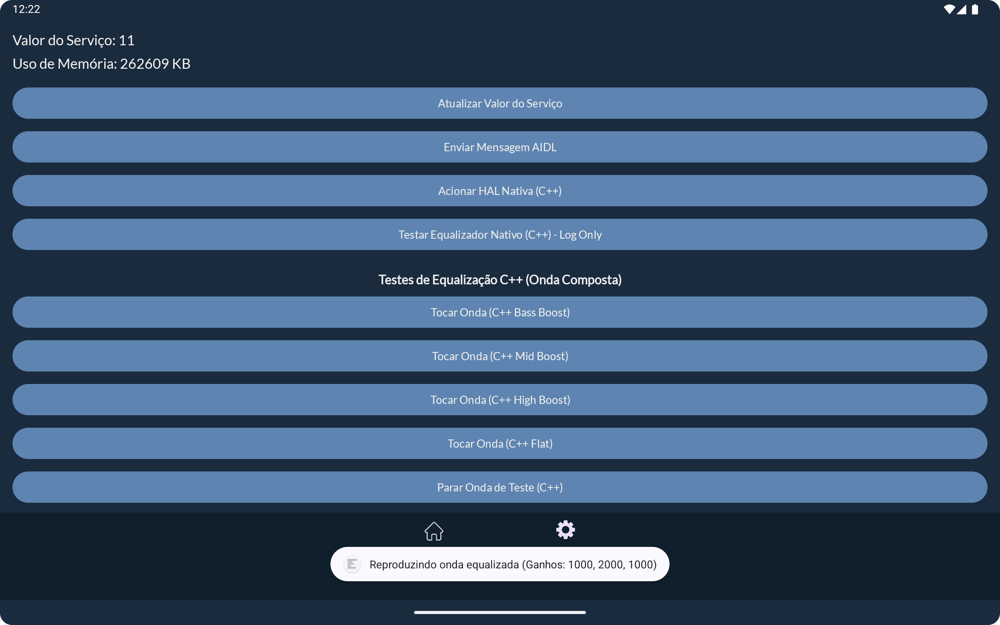
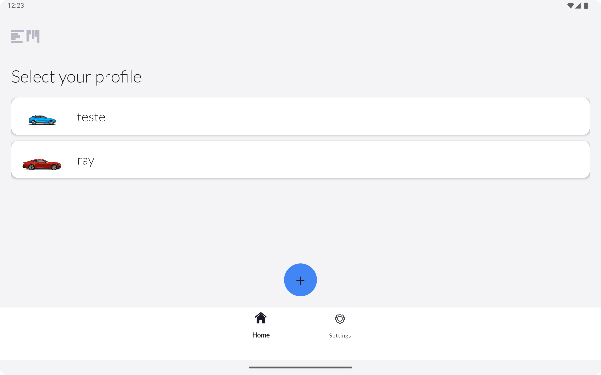
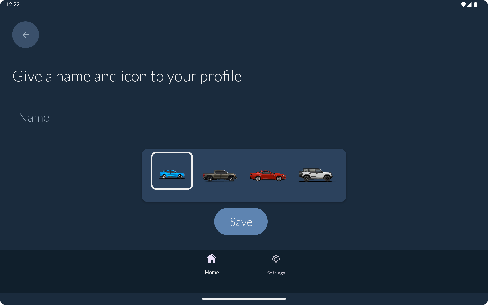
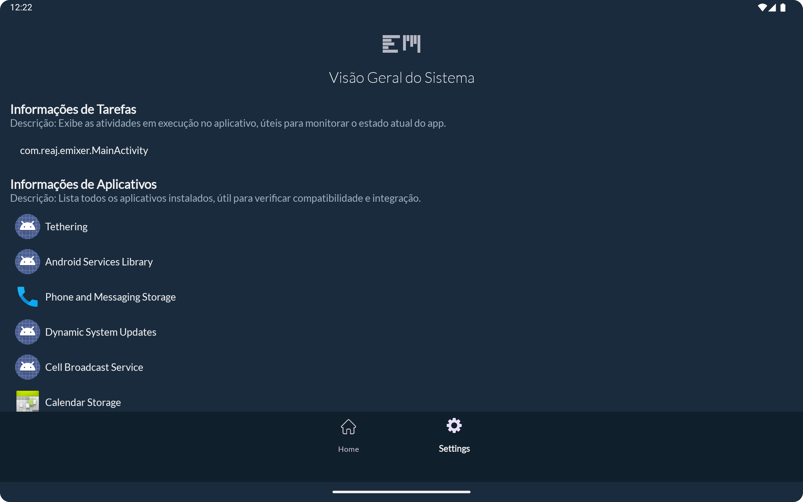

<div >
  
</div>

<p align="center">
  <a href="#visão-geral">Visão Geral</a>&nbsp;&nbsp;&nbsp;|&nbsp;&nbsp;&nbsp;
  <a href="#recursos-principais">Recursos Principais</a>&nbsp;&nbsp;&nbsp;|&nbsp;&nbsp;&nbsp;
  <a href="#layout">Layout</a>&nbsp;&nbsp;&nbsp;|&nbsp;&nbsp;&nbsp;
  <a href="#detalhes-técnicos">Detalhes Técnicos</a>&nbsp;&nbsp;&nbsp;|&nbsp;&nbsp;&nbsp;
  <a href="#permissões-do-aplicativo">Permissões do Aplicativo</a>&nbsp;&nbsp;&nbsp;|&nbsp;&nbsp;&nbsp;
  <a href="#testes">Testes</a>&nbsp;&nbsp;&nbsp;|&nbsp;&nbsp;&nbsp;
  <a href="#melhorias-futuras">Melhorias Futuras</a>
</p>

# Equalizador de Áudio para Carro - Aplicativo Android

**Um aplicativo Android personalizável para equalização de áudio precisa.**

## Equipe

* Alisson Freitas
* Eduardo Perez Uanús
* João Gabriel A. Gomes Alves
* Rayanne Andrade

## Visão Geral

Este projeto é um aplicativo Android nativo desenvolvido como parte de um curso de pós-graduação em Sistemas Embarcados (foco em Desenvolvimento Android). Embora uma versão futura vise a integração direta com sistemas de áudio automotivos, a versão atual fornece uma experiência independente em um smartphone Android, permitindo que os usuários criem e gerenciem perfis de equalização de áudio personalizados. Isso permite o teste e desenvolvimento da funcionalidade principal antes da integração com o sistema do veículo.

O aplicativo aborda o problema de equalizadores de áudio embarcados limitados ou mal projetados. Muitos veículos oferecem controle insuficiente, deixando os usuários frustrados em suas tentativas de otimizar a experiência auditiva. Nosso aplicativo oferece uma solução flexível e intuitiva.

O foco principal foi não apenas criar a funcionalidade de equalização, mas também construir um **backend de serviço de áudio resiliente e corretamente sincronizado**, capaz de gerenciar múltiplos fluxos de áudio (mídia padrão e áudio processado em C++) de forma estável, demonstrando práticas de engenharia de software sólidas para sistemas críticos como os automotivos.


## Recursos Principais

## Recursos Principais

*   **Gerenciamento de Usuários:**
    *   **Seleção de Perfil:** Alterne facilmente entre perfis de usuário existentes.
    *   **Criação/Edição de Usuário:** Adicione, edite (incluindo nome e ícone do perfil) e exclua perfis de usuário.
    *   **Importação de Perfis:** Importe os perfis dos seus contatos salvos para dentro do app.
    *   **Aviso de Modo Avião:** Avisamos quando o Modo Avião está ativo ou inativo, pois a sincronização entre os dispositivos não é possível se eles estiverem em Modo Avião.

*   **Equalizador Intuitivo:**
    *   **Controle Preciso:** Ajuste os parâmetros de áudio com um mixer amigável.
    *   **Graves (Low):** Controle de frequências baixas (aprox. 100Hz e abaixo, faixa de ajuste de -15dB a +15dB).
    *   **Médias (Mid):** Ajuste de frequências médias (aprox. 1kHz a 4kHz, faixa de ajuste de -15dB a +15dB).
    *   **Agudos (High):** Controle de frequências altas (acima de 4kHz, faixa de ajuste de -15dB a +15dB).
    *   **Balanceamento Estéreo (Pan):** Ajuste o balanceamento estéreo.
    *   **Volume Geral (Main):** Controle do volume total de saída.
    *   **Salvar/Redefinir:** Salve as configurações personalizadas do equalizador no perfil selecionado ou redefina para os valores padrão.

*   **Página de Configurações:**
    *   **Testes e Monitoramento do Serviço AIDL:** A funcionalidade de testes e monitoramento do serviço AIDL foi movida para uma página dedicada, acessível através do botão "Teste de Serviço AIDL" na página de configurações. Nesta página, é possível testar a comunicação com o serviço, visualizar o uso de memória em tempo real e enviar mensagens de teste.
    	*  **Uso de Memória:** Exibe a quantidade de memória RAM que o serviço está utilizando. Um valor alto não é necessariamente um problema, mas pode indicar que o serviço está consumindo muitos recursos e pode ser otimizado.
    *   **Visão Geral do Sistema (InfoFragment):** O aplicativo inclui um `InfoFragment` que fornece uma visão geral do sistema, listando as tarefas em execução e os aplicativos instalados. Este fragmento é útil para depuração, monitoramento e verificação de compatibilidade.
        *   **Informações de Tarefas:** Exibe as atividades em execução no aplicativo, úteis para monitorar o estado atual do app.
        *   **Integração C++ e HAL Simulada:** Nesta página, também é possível acionar uma função nativa C++ que simula a interação com uma Hardware Abstraction Layer (HAL) de áudio. Este recurso é fundamental para testar a comunicação entre as camadas Java/Kotlin e C++ do aplicativo.

        *   **Informações de Aplicativos:** Lista todos os aplicativos instalados, útil para verificar compatibilidade e integração.
    *   **Ajuste do Brilho da Tela:** O aplicativo agora ajusta o brilho da tela usando o `WindowManager`. Isso pode ser útil para otimizar a experiência do usuário em diferentes condições de iluminação.
    *   **Serviço de Primeiro Plano:** O aplicativo utiliza um serviço de primeiro plano para garantir que as funcionalidades essenciais, como a equalização de áudio, continuem funcionando mesmo quando o aplicativo não está em primeiro plano. Uma notificação persistente é exibida para informar ao usuário que o serviço está ativo.
*   **Integração C++ e HAL Simulada:**
    *   **Propósito:** Para explorar otimizações de baixo nível e interação com hardware, o aplicativo agora integra código C++ que simula uma Hardware Abstraction Layer (HAL) de áudio. Esta camada nativa permite um controle mais granular sobre recursos e prepara o terreno para futuras integrações com sistemas automotivos reais.
    *   **Tecnologias:**
        *   **JNI (Java Native Interface):** Utilizado para criar uma ponte de comunicação eficiente entre o código Kotlin/Java do aplicativo e as funções implementadas em C++.
        *   **CMake:** Gerencia o processo de build do código C++, compilando os arquivos-fonte em uma biblioteca compartilhada (`.so`) que é então carregada pelo aplicativo Android.
        *   **HAL Simulada:** Implementações em C++ de estruturas e métodos (`hw_module_t`, `audio_hw_device_t`, `audio_open`, `audio_write`) que replicam a interface de uma HAL de áudio do Android, permitindo testar o fluxo de comunicação e o comportamento esperado de uma HAL real.
    *   **Fluxo de Chamada:** A funcionalidade C++ é exposta ao aplicativo através da interface AIDL (`IMessageService.aidl`). O `MessageService.java` carrega a biblioteca nativa e invoca as funções JNI, que por sua vez interagem com a HAL C++ simulada. Isso permite que a UI (via `ServiceAIDL` Fragment) acione e teste a camada nativa.
 


## Layout 

#### The original project: [Figma](https://www.figma.com/design/ahaN4lSCMNpfLZp3OSnHPf/Emixer?node-id=0-1&p=f&t=YtUwxEKy6SIWXL8c-0)

<div style="display: flex; flex-direction: 'row'; align-items: 'center';">
	   	
	   	

</div>

## Detalhes Técnicos

Este aplicativo utiliza as seguintes tecnologias para atender aos objetivos do curso:

### Arquitetura de Serviço de Áudio Robusta

Para garantir estabilidade e consistência, foi implementada uma arquitetura de serviço desacoplada e resiliente:

*   **Serviço em Segundo Plano (`MessageService`):** Toda a lógica de reprodução e processamento de áudio (`MediaPlayer`, `Equalizer`, `AudioTrack`) é encapsulada em um serviço, garantindo que o áudio continue tocando independentemente do ciclo de vida da UI.
*   **Comunicação via AIDL:** A interface do usuário se comunica com o serviço de forma segura e interprocessual usando a Android Interface Definition Language (AIDL).
*   **Gerenciador Singleton (`AidlServiceManager`):** Centraliza a conexão com o serviço, garantindo um único ponto de controle e prevenindo múltiplas conexões.
*   **Sincronização UI-Serviço:** A UI (`UserPage`) trata o serviço como a **fonte única da verdade**. Ao se tornar visível, ela consulta o serviço para obter o estado atual (faixa, status de reprodução, posição), garantindo que a interface sempre reflita a realidade.
*   **Inicialização Sob Demanda (`Lazy Initialization`):** O `MediaPlayer` é criado apenas quando necessário (no primeiro `play`), otimizando o uso de recursos.
*   **Lógica de Volume Unificada:** Uma única função (`applyVolumeAndPan`) no serviço calcula o volume final para os canais esquerdo e direito, considerando tanto o volume principal quanto o pan, evitando conflitos e garantindo o funcionamento correto de ambos os controles.

### Integração C++ para Processamento de Áudio (DSP)

*   **Propósito:** Demonstrar a capacidade de realizar Processamento de Sinal Digital (DSP) de alto desempenho na camada nativa.
*   **Tecnologias:**
    *   **JNI (Java Native Interface):** Cria a ponte de comunicação entre o `MessageService` (Java) e a lógica de equalização em C++.
    *   **CMake:** Gerencia a compilação do código C++ em uma biblioteca compartilhada (`.so`).
    *   **Filtros Biquad (IIR):** Implementados em C++ para aplicar os efeitos de equalização (low-shelf, peaking, high-shelf) a um sinal de áudio de teste.
*   **Pipeline de Teste:** O serviço gera uma onda de teste, a envia para a camada C++ via JNI para processamento, e reproduz o resultado usando `AudioTrack` em `MODE_STREAM` para máxima compatibilidade e robustez.


### Implementação da Lógica de Equalização

*   **Objetivo:** Permitir que o usuário ajuste os parâmetros de equalização de áudio (Bass, Mid, Treble, Pan e Volume) e aplicar essas configurações em tempo real.
*   **Tecnologias:**
    *   `android.media.audiofx.Equalizer`: API do Android para manipulação do equalizador.
    *   AIDL: Utilizado para comunicação entre a interface do usuário (`UserPage`) e o serviço em segundo plano (`MessageService`).
*   **Implementação:**
    *   A interface AIDL (`IMessageService.aidl`) define métodos para ajustar cada parâmetro do equalizador (`setBass()`, `setMid()`, `setTreble()`, `setMainVolume()` e `setPan()`).
    *   O `MessageService` implementa esses métodos, aplicando as configurações ao `android.media.audiofx.Equalizer`.
    *   A validação de valores é realizada no `MessageService` para garantir que os parâmetros estejam dentro de um intervalo aceitável.
    *   O `UserPage` utiliza SeekBars para permitir que o usuário ajuste os parâmetros do equalizador, enviando os valores para o `MessageService` através da interface AIDL.

#### Controle da Equalização via AIDL: Métodos Dedicados

O `UserPage` utiliza AIDL para interagir com um serviço que controla a equalização de áudio através de métodos dedicados para cada parâmetro. Isso permite um controle mais preciso e validado das configurações de áudio.

A interface `IMessageService.aidl` define os seguintes métodos:

*   `boolean setBass(int value)`: Define o nível de graves.
*   `boolean setMid(int value)`: Define o nível de médios.
*   `boolean setTreble(int value)`: Define o nível de agudos.
*   `boolean setMainVolume(int value)`: Define o volume principal.
*   `boolean setPan(int value)`: Define o balanço estéreo (pan).
*   `int triggerNativeHalAudioWrite()`: Aciona a função C++ para simular a escrita na HAL.


+Cada método retorna um valor booleano (`true` ou `false`) para indicar se a configuração foi aplicada com sucesso (ou um `int` para o método nativo).

#### Validação de Valores

O serviço (`MessageService.java`) implementa a validação dos valores recebidos para garantir que estejam dentro de um intervalo aceitável. Por exemplo, os valores de `Bass`, `Mid` e `Treble` podem ser validados para estarem entre -15 e +15 dB, conforme definido no equalizador. O valor de `Pan` pode variar de -100 a 100, representando o balanço para a esquerda ou direita, e o `MainVolume` de 0 a 100.

Exemplo de Validação (MessageService.java):

```java
@Override
public boolean setMid(int value) throws RemoteException {
    if (value >= -15 && value <= 15) {
        Log.d("AIDL_DEMO", "Setting Mid to: " + value + " dB");
        // Aqui você aplicaria a configuração de médios usando sua API de áudio
        return true;
    } else {
        Log.w("AIDL_DEMO", "Valor inválido para Mid: " + value + " dB. Deve estar entre -15 e +15.");
        return false;
    }
}
```

#### Implementação no User Page

No UserPage.kt, cada SeekBar está associada ao seu respectivo método AIDL. Quando o usuário ajusta um SeekBar, o método correspondente é chamado no serviço, e o valor é validado antes de ser aplicado. O valor de retorno booleano é usado para verificar se a configuração foi aplicada com sucesso e registrar logs apropriados.

Exemplo de Uso (UserPage.kt):

```kotlin
private fun setMid(value: Int) {
    if (isServiceBound) {
        try {
            val success = messageService?.setMid(value) ?: false
            if (success) {
                Log.d("UserPage", "Configurando Mid para $value: Sucesso")
            } else {
                Log.w("UserPage", "Falha ao configurar Mid para $value (valor inválido?)")
            }
        } catch (e: RemoteException) {
            Log.e("UserPage", "RemoteException: ${e.message}")
        }
    } else {
        Log.w("UserPage", "Serviço não está vinculado")
    }
}
```
Essa implementação garante que o controle de áudio seja modular, validado e capaz de fornecer feedback sobre o sucesso ou falha das operações.

## Permissões do Aplicativo

Para garantir o funcionamento completo e eficaz do aplicativo, são necessárias algumas permissões específicas. Abaixo estão listadas as permissões essenciais e suas funcionalidades:

### Permissão para Acesso a Arquivos de Áudio

Para ajustar os parâmetros de equalização de forma eficaz, o aplicativo precisa acessar os arquivos de áudio do dispositivo.

- **Permissão Solicitada:** `android.permission.READ_MEDIA_AUDIO`
- **Função:** Garante acesso somente à leitura dos arquivos de mídia de áudio, sem acessar outros dados do dispositivo.
- **Importância:** Sem esta permissão, o aplicativo não poderá ajustar as configurações de equalização.
- **Privacidade:** Não coleta informações pessoais.

### Permissão para Modificar Configurações de Áudio

O aplicativo tem a capacidade de modificar as configurações de áudio globais.

- **Permissão Incluída:** `android.permission.MODIFY_AUDIO_SETTINGS`
- **Função:** Permite que o aplicativo modifique as configurações de áudio globais, como o equalizador.
- **Concessão:** Esta permissão é concedida automaticamente no momento da instalação, não requer solicitação em tempo de execução (runtime).

### Permissão de Acesso à Lista de Contatos

Para permitir a importação de perfis, o aplicativo requer acesso à lista de contatos do dispositivo.

- **Permissão Solicitada:** `android.permission.READ_CONTACTS`
- **Função:** Garante acesso somente à leitura da lista de contatos, sem acessar outros dados do dispositivo.
- **Importância:** Sem esta permissão, o aplicativo não poderá importar as configurações para a criação do perfil.
- **Privacidade:** Não coleta informações pessoais.

### Permissões para Serviço de Primeiro Plano
O aplicativo utiliza um serviço de primeiro plano para garantir a execução contínua de funcionalidades essenciais, como a equalização de áudio, mesmo quando o aplicativo está em segundo plano. Para isso, são necessárias as seguintes permissões:

- **`android.permission.FOREGROUND_SERVICE`**: Permissão genérica para serviços de primeiro plano.
- **`android.permission.FOREGROUND_SERVICE_MEDIA_PLAYBACK`**: Permissão específica para serviços de primeiro plano que utilizam `foregroundServiceType="mediaPlayback"`.

Essas permissões são fundamentais para oferecer uma experiência de uso otimizada e personalizável aos usuários.

## Testes

Para garantir a alta qualidade e confiabilidade do aplicativo, foram implementados testes unitários e instrumentais abrangentes.  A estratégia de teste visa cobrir tanto a lógica interna do aplicativo quanto a interação do usuário com a interface.

### Testes Unitários

Os testes unitários validam a funcionalidade individual de componentes menores do código, assegurando que cada parte opere conforme o esperado.  Utilizamos o MockK para simular dependências e o Kotlin Coroutines Test para controlar o escopo de execução das corrotinas.  Os testes unitários foram focados principalmente no `MainViewModel`, que gerencia a lógica de negócio principal do aplicativo.

**Casos de Teste do `MainViewModel`:**

* **`initialState_shouldHaveEmptyUserList()`:** Verifica se a lista de usuários está vazia ao inicializar o `ViewModel`.
* **`addUser_shouldAddUserToList()`:** Verifica se um novo usuário é adicionado corretamente à lista.
* **`addMultipleUsers_shouldContainAllUsers()`:** Verifica se múltiplos usuários são adicionados e mantidos na lista.
* **`addAndRemoveUser_shouldHandleCorrectly()`:** Verifica se a adição e remoção de usuários são executadas corretamente.

* **Casos de Teste dos `Managers`:**

* **`Managers`:**
    *   **`AidlServiceManagerTest`:** Valida a vinculação e desvinculação do serviço.
    *   **`AudioManagerTest`:** Valida a correta conversão e envio dos parâmetros de áudio (Bass, Mid, Treble, Pan, Volume).
    *   **`AudioSettingsManagerTest`:** Valida o comportamento dos listeners das SeekBars.
    *   **`PermissionManagerTest`:** Valida a lógica de verificação e solicitação de permissões.


### Testes Instrumentais (UI)

Os testes instrumentais utilizam o Espresso para simular interações do usuário com a interface do aplicativo em um ambiente real (ou simulado). Eles validam fluxos de trabalho completos, garantindo que a experiência do usuário seja fluida e intuitiva. Os testes foram focados nas telas críticas de interação com o usuário, assegurando a correta funcionalidade das telas, incluindo o `AddUser` and `ManageUser` Fragment.


**Casos de Teste Instrumentais:**

* **`addUserTest()`:** Verifica o fluxo completo de adicionar um novo usuário, incluindo navegação entre telas, entrada de dados e validação.
* **`editUserTest()`:** Verifica o fluxo de edição de um usuário existente, incluindo a atualização de dados e a validação das mudanças.
* **`deleteUserTest()`:** Verifica o fluxo de exclusão de um usuário, incluindo a confirmação da ação e a remoção do usuário da lista.


### Estratégia de Testes:

A combinação de testes unitários e instrumentais oferece uma cobertura de teste robusta.  Testes unitários garantem a correta funcionalidade da lógica interna, enquanto os testes instrumentais validam a interação do usuário com a interface e a integração entre diferentes componentes.  Esta abordagem minimiza a probabilidade de erros e contribui para a criação de um aplicativo estável e confiável.


### Executando os Testes:

Para executar os testes:

* **Testes Unitários:** Execute os testes JUnit utilizando o seu ambiente de desenvolvimento (ex: Android Studio).
* **Testes Instrumentais:** Execute os testes instrumentais com o Android Studio, utilizando o menu "Run" -> "Run 'Todos os Testes Instrumentais'".

* A arquitetura desacoplada (UI -> Managers -> Service) facilita a criação de testes focados, melhorando a manutenibilidade e a confiabilidade do código.

## Melhorias Futuras

O desenvolvimento futuro se concentrará em:

* **Integração com Sistemas Automotivos:** Conectar o aplicativo ao sistema de áudio de um veículo para controle direto, aproveitando a base estabelecida pela integração da HAL C++.
* **Recursos Avançados de Equalização:** Explorar algoritmos e opções de equalização mais sofisticados, possivelmente implementando processame
* **Módulo de Notificação Dinâmico:** Implementar uma notificação persistente e interativa para controlar a reprodução de mídia em segundo plano.
* **Recursos Adicionais:** Implementar recursos como predefinições, visualizações, sincronização entre dispositivos, tela para escolha de quais contatos importar, controle de acesso e recursos de interação social.


